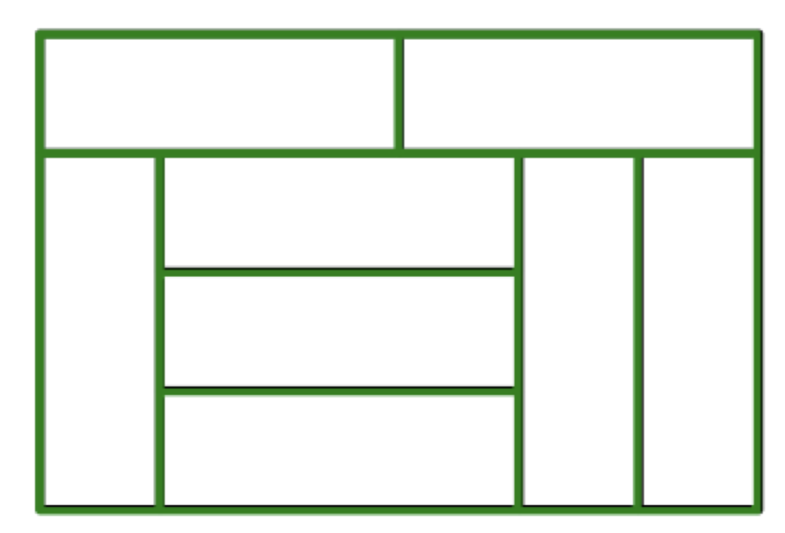
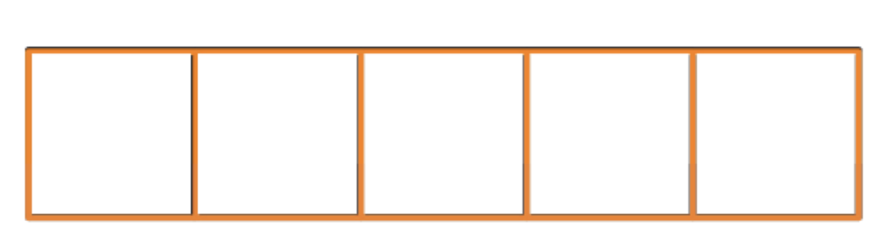
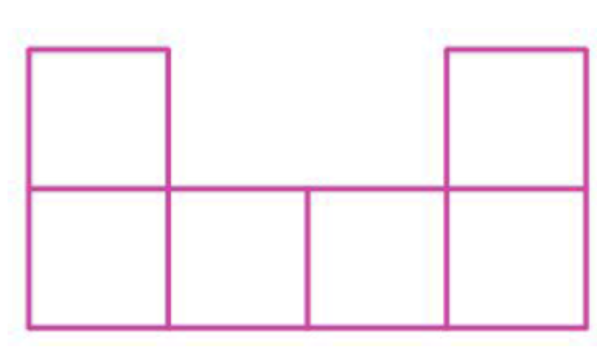

# 附加题

**1.** 下图是由 8 个相同的小长方形拼成的大长方形，已知小长方形的长是 9 厘米，宽是 3 厘米，那么拼成的大长方形的周长是多少厘米？

**2.** 一个长方形被平均分成了 5 个小正方形，已知每个小正方形的周长是 13 厘米，那么大长方形的周长是多少厘米？

**3.** 用 6 个大小相同的正方形拼成如下图所示的图形后，周长比原来 6 个正方形周长的和少了 20 厘米，那么原来一个正方形的周长是多少厘米？

