**· 闯关 1 ·**
12 个边长为 2 厘米的正方形，可以拼出多少种不同周长的长方形？
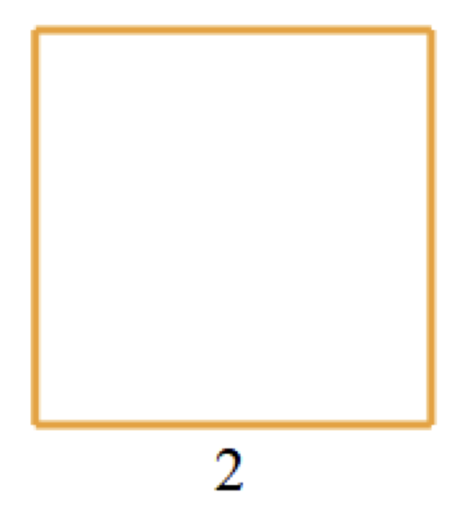

**· 闯关 2 ·**
用 5 个长为 2 厘米，宽为 1 厘米的长方形拼成一个大长方形，在所有可能的拼法中，大长方形周长最小是多少厘米？
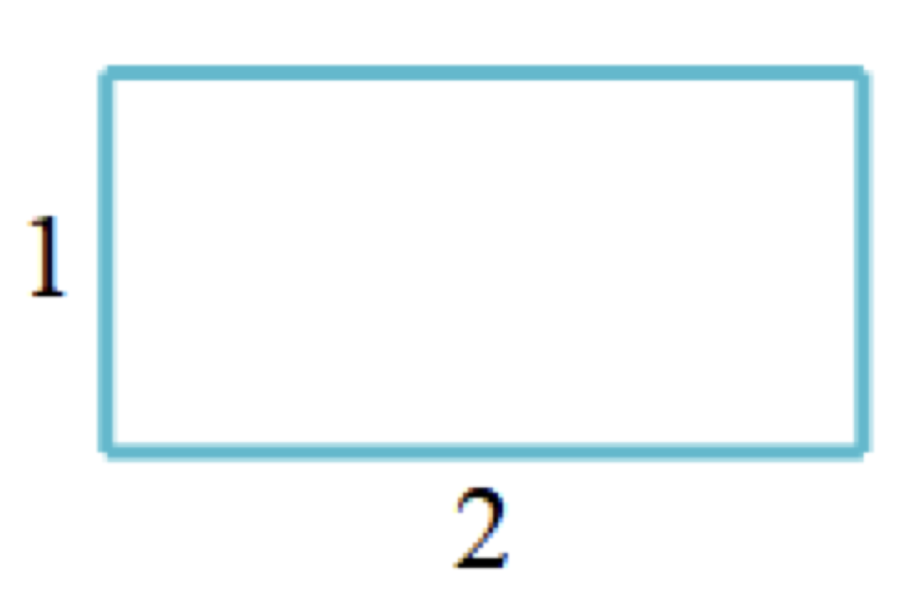

**· 闯关 3 ·**
如图所示，一个正方形被分成了三个相同的长方形．如果这个正方形的周长是 12 厘米，那么其中一个长方形的周长是多少厘米？
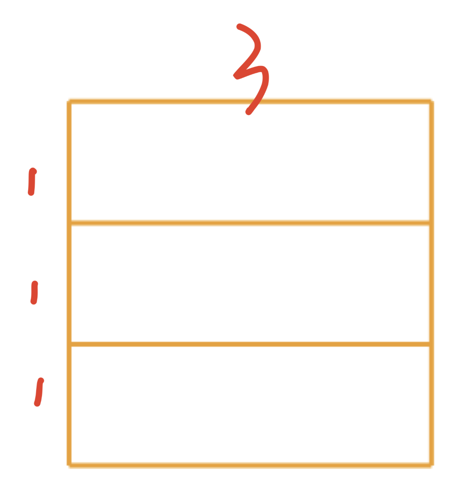

**· 闯关 4 ·**
如图，用 8 个相同的小长方形拼成一个大长方形，已知大长方形的周长是 28 厘米，那么小长方形的周长是多少厘米？
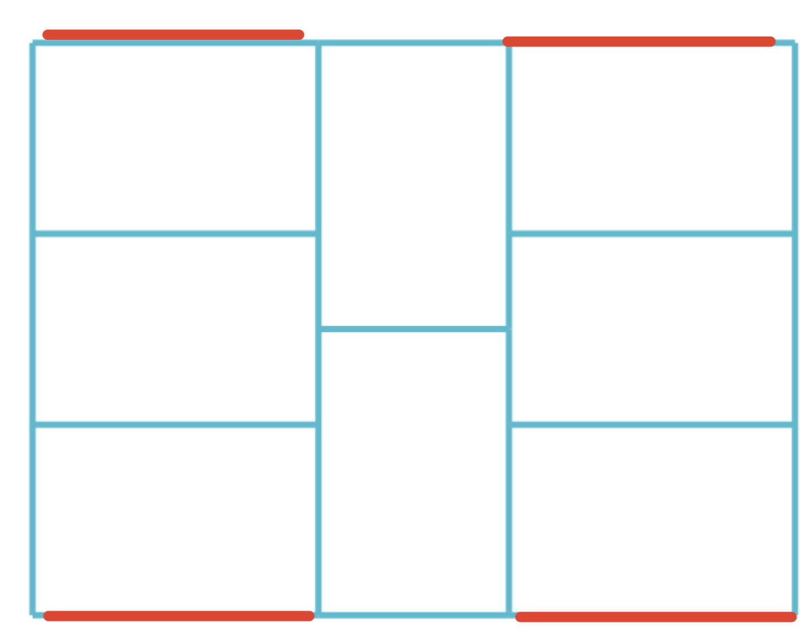

**· 闯关 5 ·**
一个周长为 22 厘米的正方形，沿着水平方向和竖直方向各剪一刀，如图所示，请问剪完后形成的 4 个小长方形的周长之和是多少厘米？
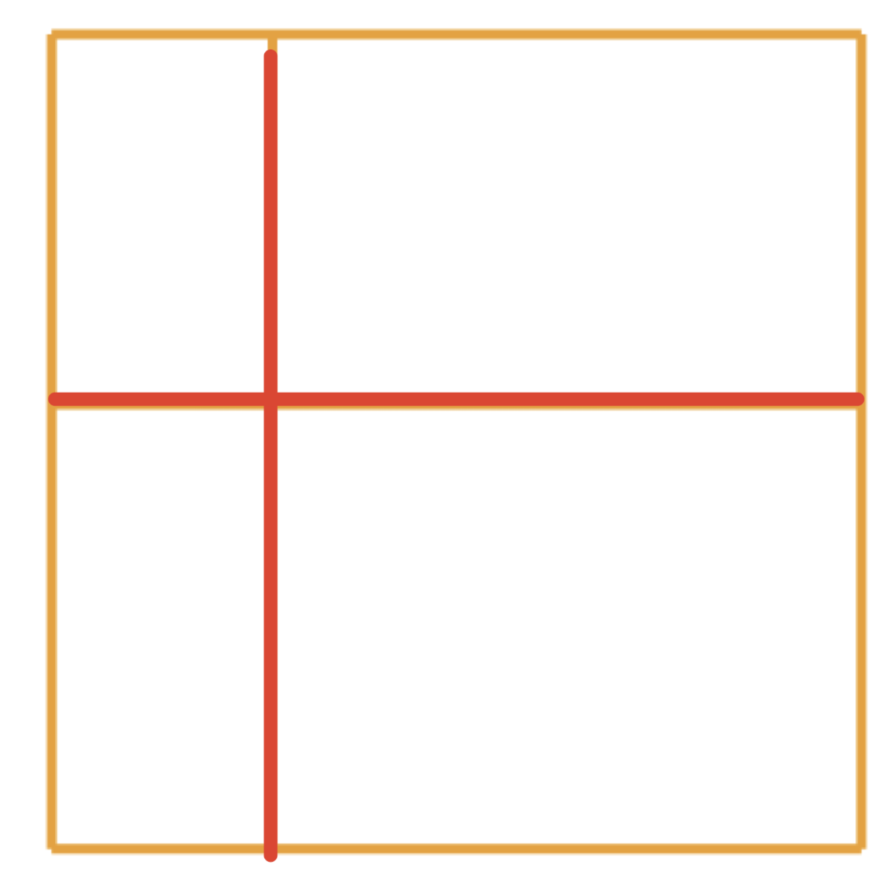

**· 闯关 6 ·**
一张长为 20 厘米、宽为 10 厘米的长方形纸片，被横着剪了三刀，竖着剪了四刀，剪完后所形成的所有长方形的周长总和是多少？
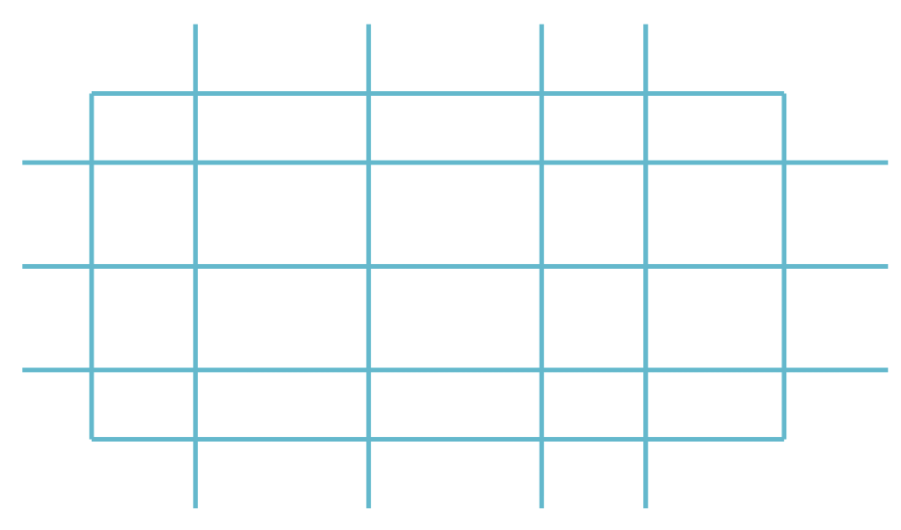

**· 闯关 7 ·**
在一个长为 8 厘米，宽为 6 厘米的长方形纸片上剪去一个边长为 3 厘米的正方形．
1）如下左图，如果剪去的正方形在右上角，那么剩下的图形周长是多少厘米？
2）如下右图，如果剪去的正方形在右边，那么剩下的图形周长是多少厘米？
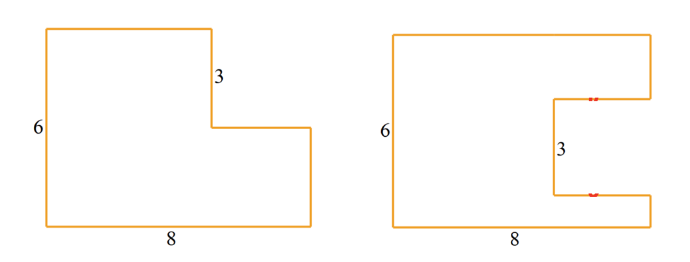

**· 闯关 8 ·**
把 4 个长为 3 厘米、宽为 1 厘米的长方形摆成如下图形，则图形的周长是多少厘米？
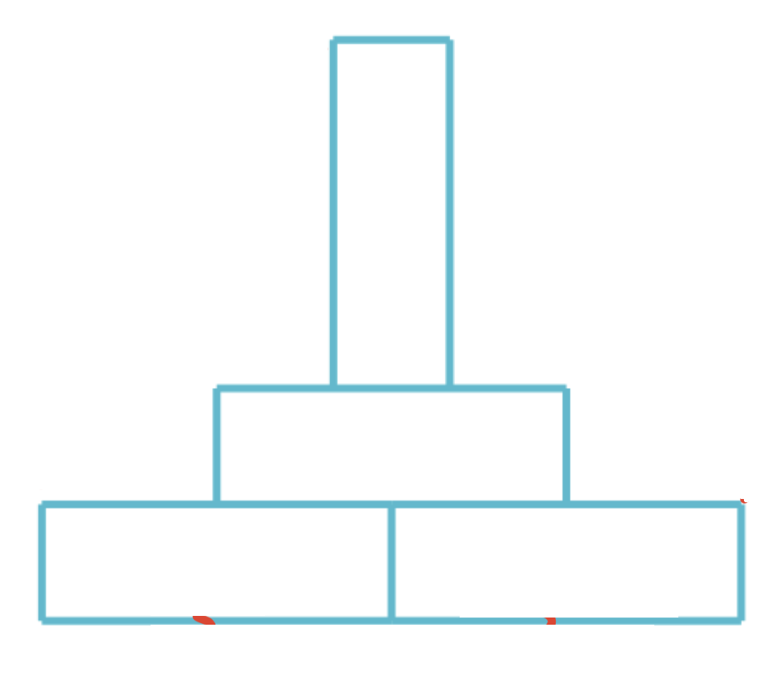

**· 闯关 9 ·**
请求出下面图形的周长．（单位：厘米）
[注：对应文档中复杂的阶梯状多边形]
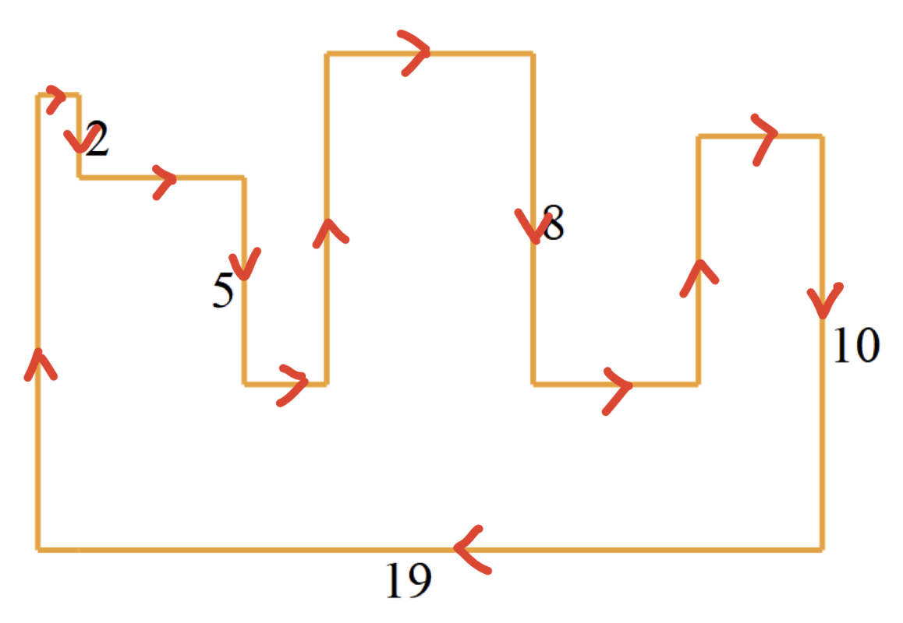

**· 闯关 10 ·**
如下图所示，图形的边长已由字母标出，如果想求出这个图形的周长，最少需要知道几条边的长度？
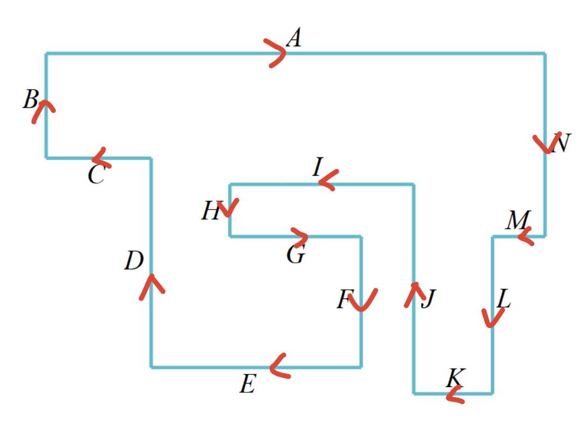

**· 闯关 11 ·**
如图，用一个边长是 4 厘米的小正方形和 4 个相同的长方形，一起拼成一个边长是 10 厘米的大正方形，那么小长方形的长和宽分别是多少厘米？
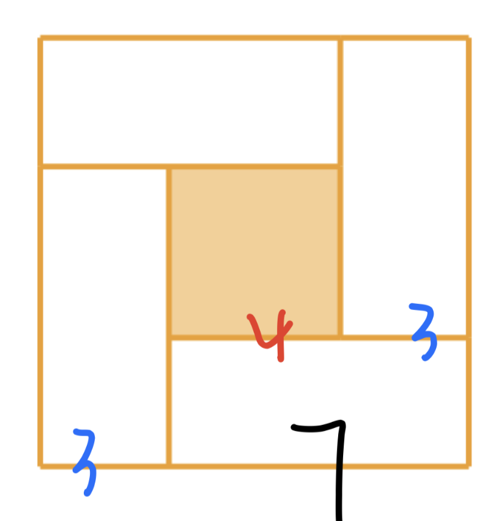

**· 闯关 12 ·**
下面的大正方形是由 8 个相同的小长方形和 1 个小正方形拼成的，已知图中大正方形的周长为 400，小正方形的周长为 160，求每个小长方形的周长是多少？
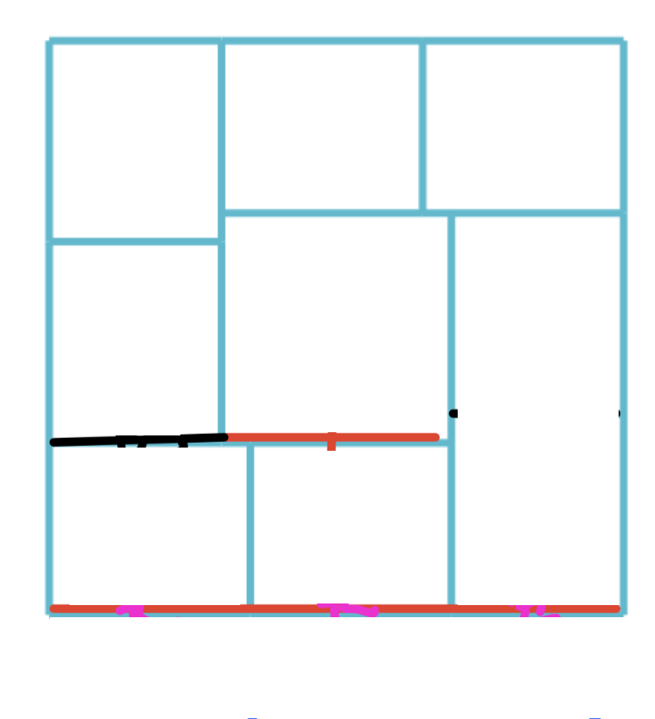
