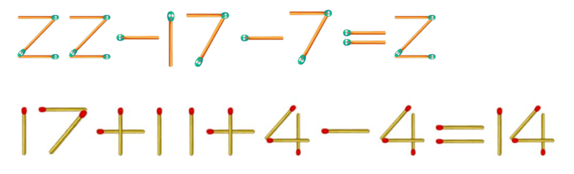
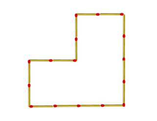
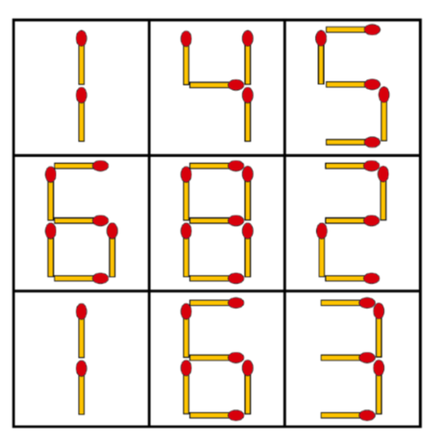
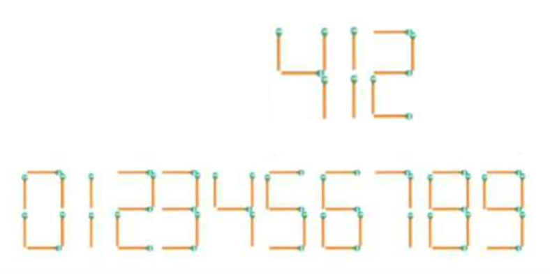
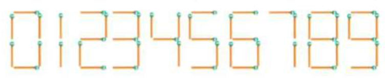

### 第 45 讲 火柴棒变身

#### 1. 请移动一根火柴棒，使下列算式成立。
1）22 - 17 - 7 = 2
2）17 + 11 + 4 - 4 = 14

#### 2. 如图是用 16 根火柴棒搭出的图形。请在图形内部加入 8 根火柴棒，将这个图形四等分。

#### 3. 下面方格里的数字，都是由火柴棒组成的，请你移动其中的 1 根火柴棒，使每一横行或竖行里的数字相加的和都相等。

#### 4. 用火柴棒可以摆出数字 0 到 9，按照这个摆放要求，用火柴棒摆出了一个三位数，412。请你移动一根火柴棒变成一个新的四位数，这个数最大是多少？

#### 5. 火柴棒可以摆出如下图的数字 0~9，按照图中摆放要求，给你 8 根火柴棒，要求全部用完，一共可以摆出多少个不同的两位数？
