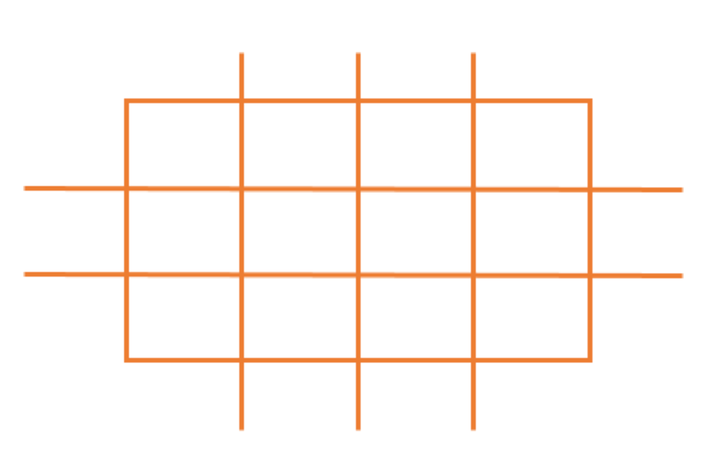
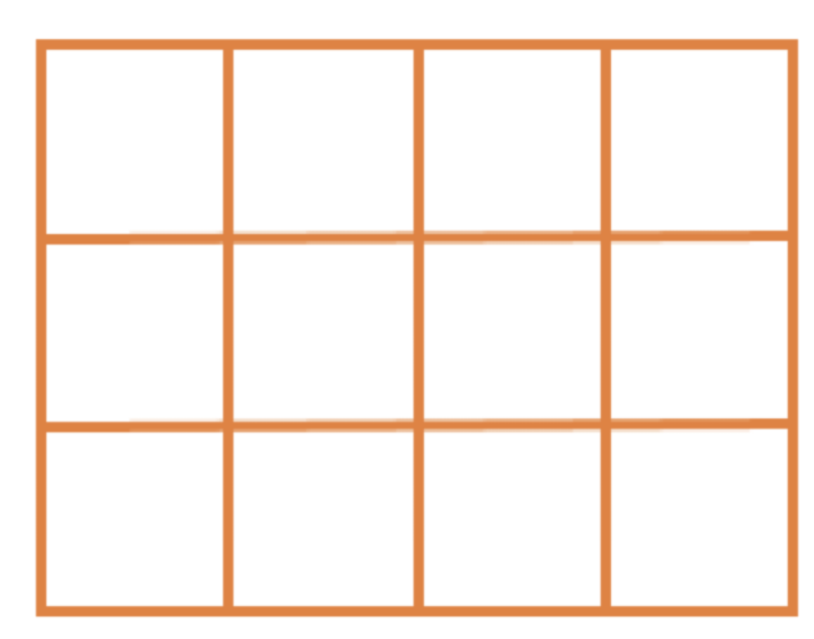
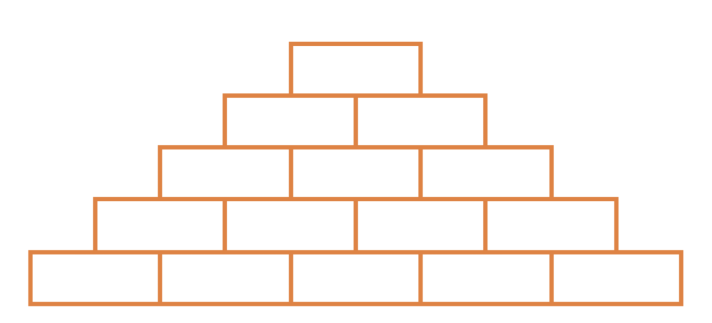
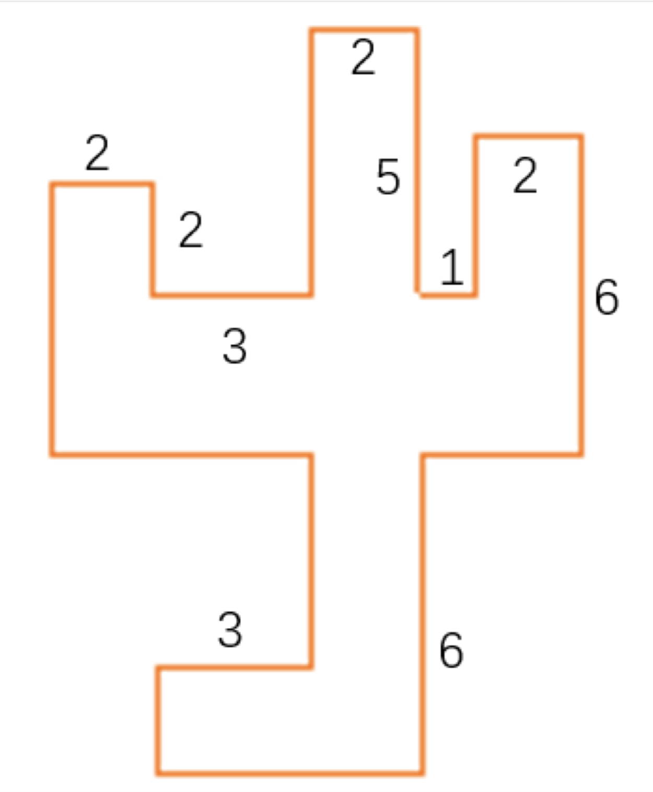

**1.** 把边长分别是 5 厘米、4 厘米、3 厘米和 2 厘米的 4 个正方形按从大到小的顺序排成一行，排成的图形周长是多少厘米？

**2.** 如图所示，一张长为 10 厘米、宽为 5 厘米的长方形纸片，立立将其横着剪了 2 刀，竖着剪了 3 刀，请问剪完后得到的所有长方形的周长之和是多少厘米？

**3.** 如图，把一个大长方形分成 12 个小正方形，已知每个小正方形的周长为 8 厘米，求大长方形的周长？

**4.** 下图是由 15 个长为 10 厘米，宽为 4 厘米的小长方形组合而成，求这个图形的周长？

**5.** 如下图所示，相邻的两条线段互相垂直，求这个多边形的周长是多少？

