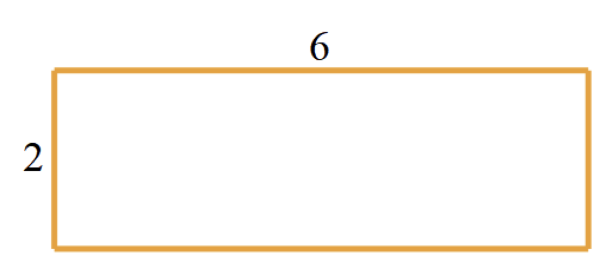
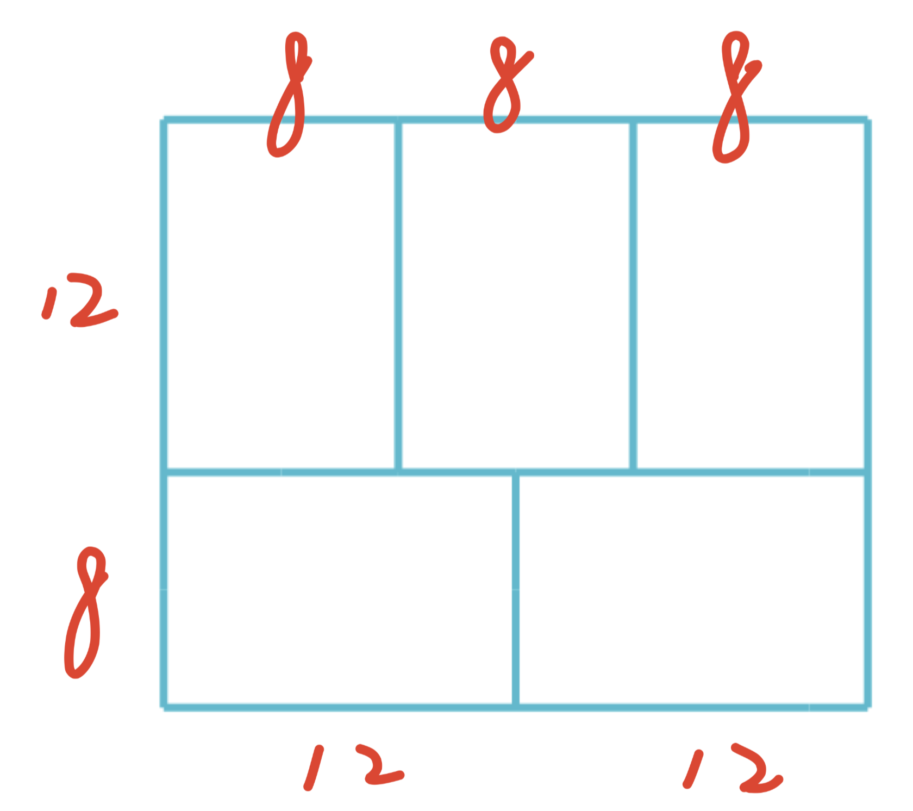
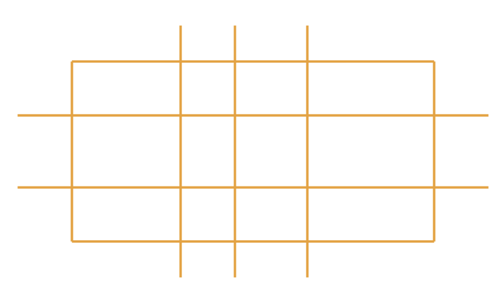
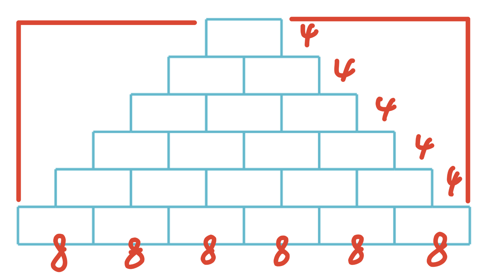
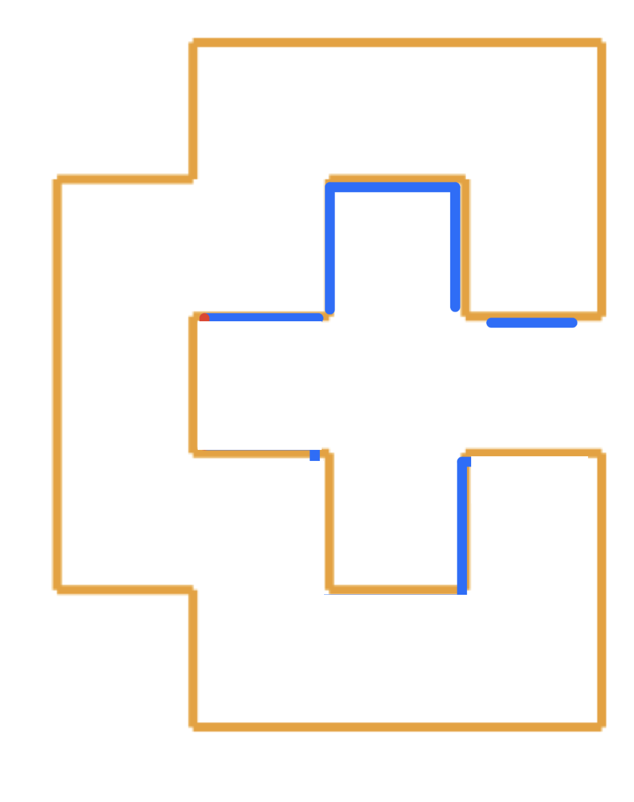
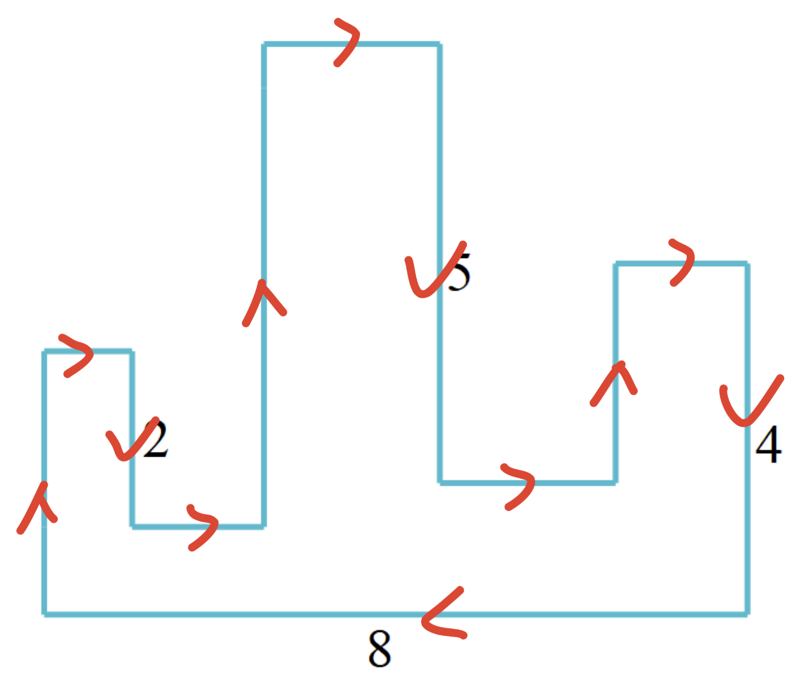

**· 课后巩固 1 ·**
用 4 个长 6 厘米、宽 2 厘米的长方形拼成一个大长方形，请问拼成的大长方形的周长有多少种不同的可能？

**· 课后巩固 2 ·**
如图所示，用 5 个相同的长为 12 厘米的小长方形拼成一个大长方形，请问大长方形的周长是多少厘米？

**· 课后巩固 3 ·**
如图所示，一个长为 20 厘米、宽为 10 厘米的长方形纸片，被横着剪了两刀，竖着剪了三刀，剪完后所形成的所有长方形的周长总和是多少？

**· 课后巩固 4 ·**
下图是一面砖墙的平面图，每块砖长 8 厘米，高 4 厘米，一共摆了 6 层，请问摆好后的图形的周长是多少厘米？

**· 课后巩固 5 ·**
如图是一个玩具的侧面图，任意相邻的两条边都互相垂直，图中最短线段（共 15 条）的长度都是 3 厘米，请问这个玩具侧面图的周长是多少厘米？

**· 课后巩固 6 ·**
如图所示，这个多边形任意相邻的两条边都互相垂直，求这个多边形的周长是多少？

