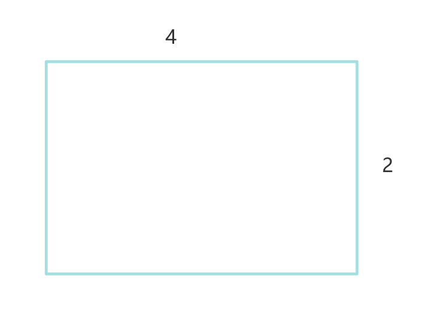
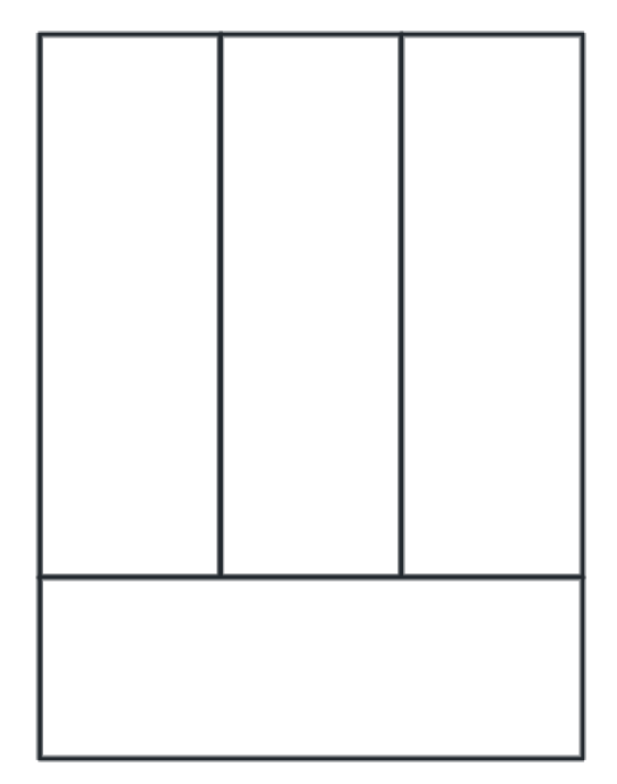
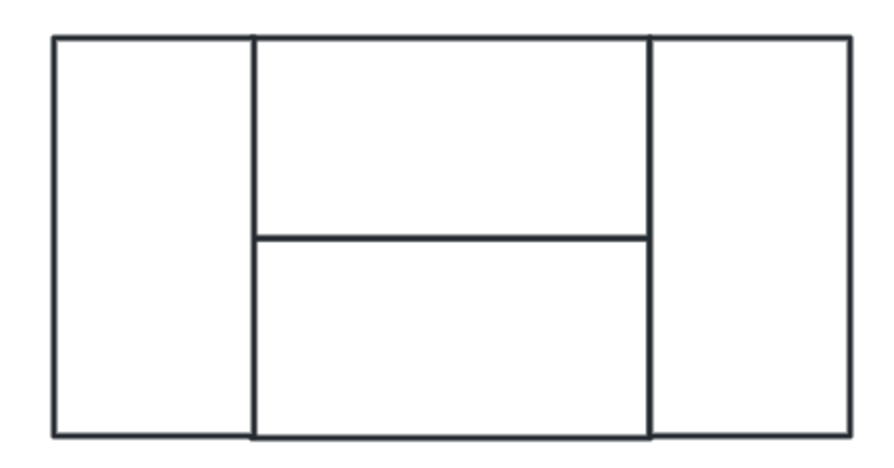
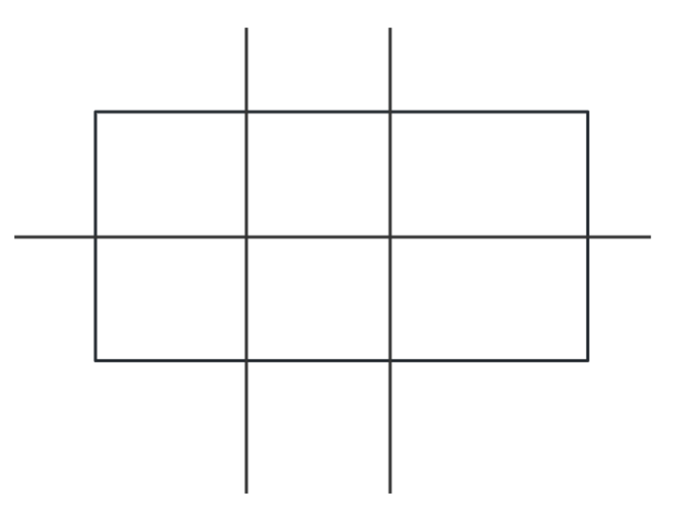
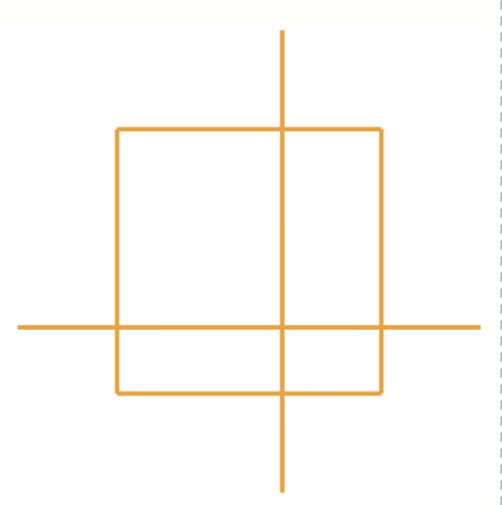
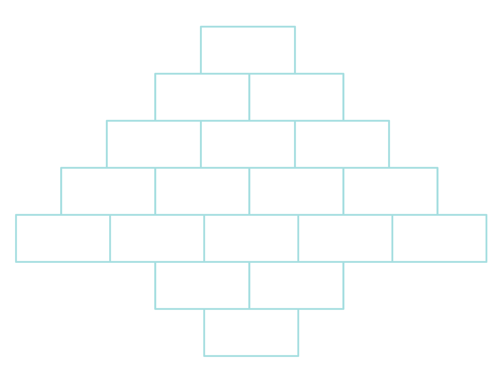
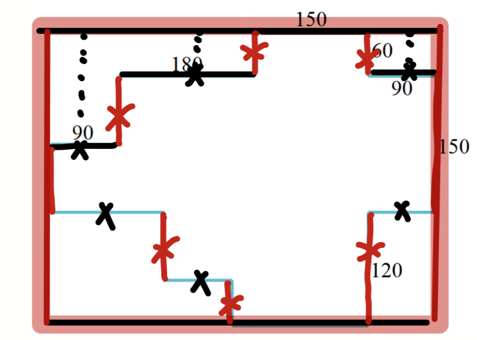
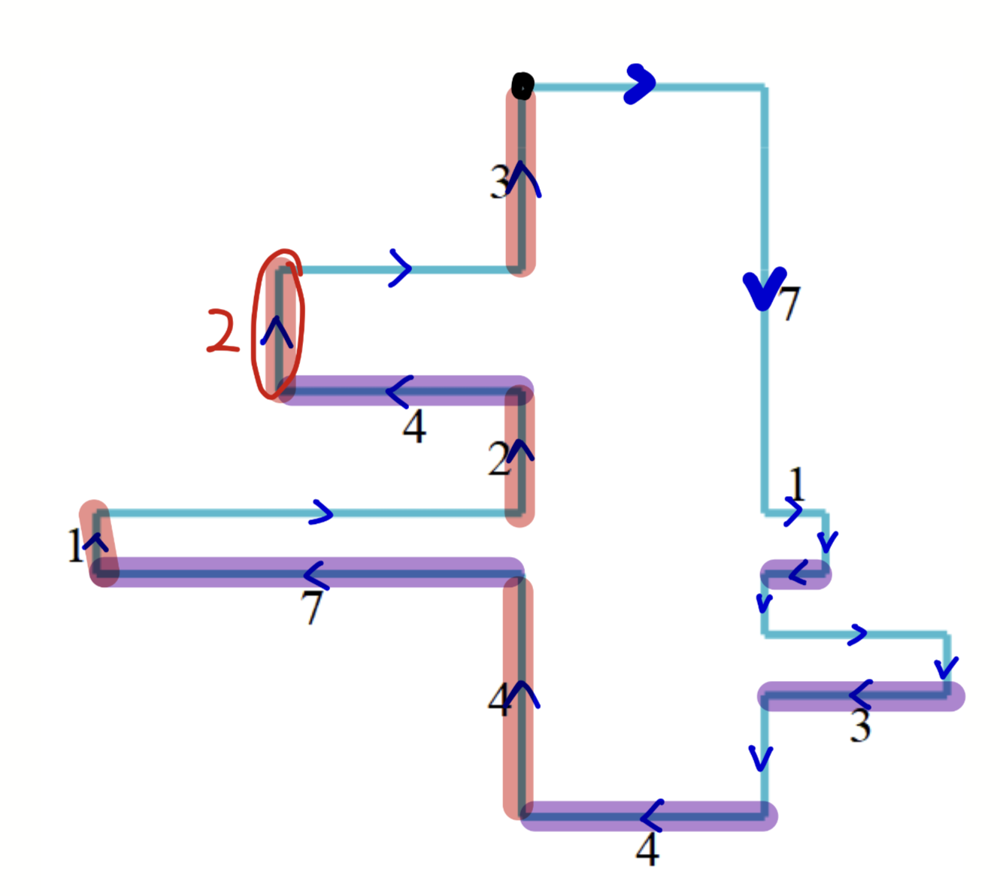
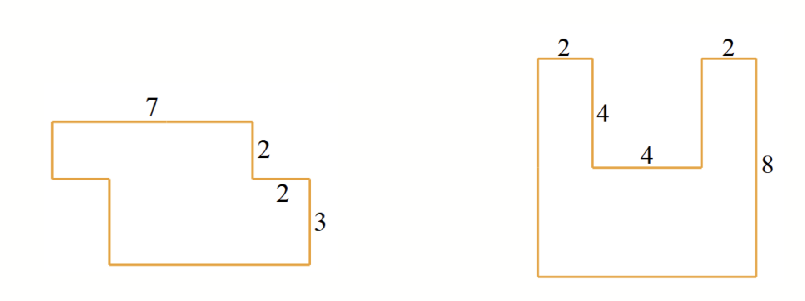

### 第 40 讲 一圈有多长（周长问题）

#### 模块 1：长方形、正方形周长

**· 例题 1 ·**
用 3 个长 4 厘米、宽 2 厘米的长方形拼成一个大长方形，请问拼成的大长方形的周长有多少种不同的可能？

**· 练一练 ·**
用 6 个边长为 3 厘米的正方形拼成一个大长方形，请问拼成的大长方形的周长有多少种不同的可能？

**· 例题 2 ·**
如图所示，用 4 个相同的长为 9 厘米的小长方形拼成一个大长方形，请问大长方形的周长是多少厘米？

**· 练一练 ·**
如图所示，用 4 个相同的宽为 5 厘米的小长方形拼成一个大长方形，请问大长方形的周长是多少厘米？

**· 例题 3 ·**
下图是一张长为 7 厘米、宽为 3 厘米的长方形纸片，立立将其横着剪了一刀，竖着剪了两刀，请问剪完后得到的所有长方形的周长之和是多少厘米？

**· 练一练 ·**
如图所示，纳纳将一张边长为 8 厘米的正方形纸片横着剪了一刀，竖着剪了一刀，请问剪完后得到的所有长方形的周长之和是多少厘米？

---

#### 模块 2：不规则图形的周长

**· 例题 4 ·**
六一儿童节快要到了，纳约小学一年级一班准备了一些相同的礼品盒，已知每个礼品盒长 20 厘米，高 10 厘米，将其摆好后的正面图如下图所示，请问整个图形的周长是多少厘米？

**· 练一练 ·**
如图所示，用 20 个边长为 4 厘米的等边三角形拼接成一个大的平行四边形，请问大平行四边形的周长是多少厘米？

**· 例题 5 ·**
下图是某个小区的平面图（单位：米），约约每天早上会沿着小区晨跑 2 圈，请问约约每天跑多少米？

**· 练一练 ·**
求下面两个图形的周长。（单位：厘米）
[注：对应文档中两个阶梯状/凹凸状的不规则图形]

**· 例题 6 ·**
如图所示，这个多边形任意相邻的两条边都互相垂直，求这个多边形的周长是多少？

**· 练一练 ·**
如下图，这个多边形任意相邻的两条边都互相垂直，求这个多边形的周长是多少？

