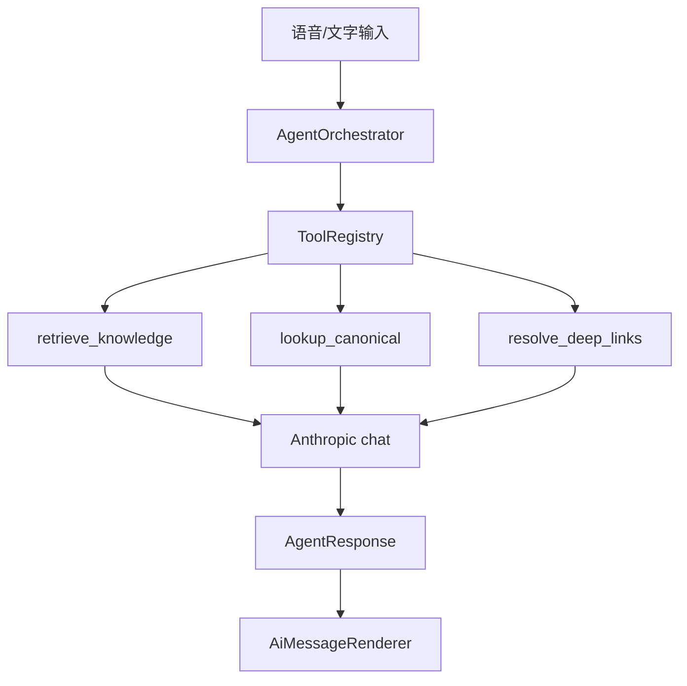

# RAG 知识库系统设计

> 日期：2026-08-10（评审修订：2026-08-10）
> 状态：评审修订完成（含 Agent 响应协议），待分阶段实现

## 概述

为 Rosie 学习乐园引入 **Rosie Agent**（混合交互智能体 + RAG 知识库），建立英语、数学、语文三科知识库，支持：
1. **知识问答**：孩子向 AI 提问（**语音为主**），获得基于知识库的适龄解答
2. **混合交互响应**：除文字外，返回 **卡片 / 文章节选 / 题解 / 可点击跳转** 等结构化 UI
3. **智能出题**：基于知识内容自动生成练习题
4. **弱项强化训练**：AI 分析薄弱点，每日推送个性化训练任务

## 核心约束

- **用户**：小学低年级儿童（Rosie），界面需简洁友好
- **AI 服务**：优先复用现有 **Anthropic** 栈（chat）；Embedding / Vision / STT 选用 **OpenAI-compatible 单一 provider**（若 Qoder 可用且兼容则统一密钥，否则 Anthropic chat + 独立 embed provider）。实现前须锁定 embed 维度与模型标识
- **知识来源**：**双通道 ingest** — Supabase 结构化数据 + **bundled TS catalog**（math-content、chinese passages/poems、english reading）+ 手动导入外部文本/PDF
- **基础设施**：Supabase pgvector（不引入额外向量数据库）
- **包边界**：新建 `@rosie/ai`（**不**放入 `@rosie/core`）

## 架构原则：Structured-first + RAG-second + Agent Envelope

弱项出题 / 每日训练 **不依赖向量检索**；开放问答 / 课文理解才走 RAG。
所有面向孩子的回复统一走 **Agent Response Envelope**（`blocks` + `actions`），而不只是 Markdown 气泡。

```
孩子提问 / 出题请求（语音/文字）
        │
        ▼
   Agent 编排器（意图 → Tools）
        │
        ├─ 弱项/出题/复习 ──► 结构化直查（mastery + canonical）
        │
        └─ 开放问答 / 课文理解 ──► RAG 检索（pgvector + Hybrid）
        │
        ▼
   LLM 生成 AgentResponse { blocks[], actions[] }
        │
        ▼
   混合渲染器（文字 / 卡片 / 题解 / 按钮跳转）
```

**好处**：与现有 `word_key` / `problem_key` / `char_key` / 路由体系一致；可跳转现有课时页、题目详情、草稿；比纯聊天更可用。

---

## Rosie Agent：混合交互智能体

### 定位

**不是**全自动多步 ReAct Agent（单用户、儿童场景无需复杂自治循环）。
**是**「编排器 + 工具调用 + 结构化响应 + 客户端渲染」的 **混合交互智能体**：

| 层 | 职责 |
|----|------|
| **Orchestrator** | 意图识别 → 选择 Tools → 组装上下文 |
| **Tools** | 检索、canonical 直查、deep link 解析、（P1+）出题/弱项 |
| **LLM** | 基于 tool 结果生成儿童友好文案 + 结构化 blocks/actions |
| **Renderer** | `@rosie/ai` 按 block `type` 渲染不同 UI |

### 总体架构



### Agent Response Envelope

一次 assistant 回复 = **一个消息**，载荷为结构化 JSON（存 DB + SSE 下发）：

```typescript
/** packages/ai/src/types/agent-response.ts */

export interface AgentResponse {
  /** 纯文本摘要（必填；DB content 列、TTS、无障碍） */
  text: string;
  blocks: AgentBlock[];
  actions: AgentAction[];
  sources?: AgentSource[];
}

export interface AgentSource {
  sourceRef: string;
  title: string;
  snippet?: string;
  subject?: 'english' | 'math' | 'chinese';
}
```

### Block 类型（`AgentBlock`）

| type | 说明 | 阶段 | 渲染组件 |
|------|------|------|---------|
| `text` | 儿童友好说明 | **P0** | `AgentTextBlock` |
| `word_card` | 英语单词卡 | **P0** | `AgentWordCard` |
| `char_card` | 汉字卡 | **P0** | `AgentCharCard` |
| `passage_excerpt` | 课文/阅读节选 | **P0** | `AgentPassageBlock` |
| `math_solution` | 数学题解步骤 | **P0** | `AgentMathSolutionBlock` |
| `poem_card` | 古诗卡片 | P0.5 | `AgentPoemCard` |
| `ai_quiz` | 内联 AI 题 | P1 | `AgentQuizInline` |
| `weakness_summary` | 弱项摘要 | P2 | `AgentWeaknessCard` |
| `scratch_hint` | 草稿提示 | P0.5 | `AgentScratchHintBlock` |

**原则**：

- **题解优先 canonical**：数学 `fromCatalog: true` 时 steps 来自 `Problem.analysis[]`；LLM 只改写讲解语气。
- **长文不全文堆聊天**：`passage_excerpt` + action「读全文」。
- **草稿不在聊天里画板**：`scratch_hint` + `open_scratch` 进现有题目页。

```typescript
type AgentBlock =
  | { type: 'text'; content: string }
  | {
      type: 'word_card';
      sourceRef: string;
      word: string;
      ipa?: string;
      chineseDef: string;
      example?: string;
    }
  | {
      type: 'char_card';
      sourceRef: string;
      char: string;
      pinyin: string;
      phrases: string[];
    }
  | {
      type: 'passage_excerpt';
      sourceRef: string;
      title: string;
      bookSlug?: string;
      lessonKey?: string;
      paragraphs: string[];
    }
  | {
      type: 'math_solution';
      sourceRef: string;
      problemId: string;
      title: string;
      steps: string[];
      finalAnswer?: string;
      fromCatalog: boolean;
    }
  | { type: 'poem_card'; sourceRef: string; title: string; author?: string; lines: string[] }
  | { type: 'ai_quiz'; quizId: string; questions: AiQuestion[] }
  | { type: 'weakness_summary'; subject: string; items: Array<{ label: string; severity: string }> }
  | { type: 'scratch_hint'; problemId: string; title: string };
```

### Action 类型（`AgentAction`）

由 `AgentActionBar` 渲染；**仅允许 app 内相对路径**（服务端校验）。

| type | 说明 | 阶段 |
|------|------|------|
| `navigate` | 路由跳转 | **P0** |
| `open_problem` | 跳转题目详情 | **P0** |
| `open_reading` | 跳转课文/阅读页 | **P0** |
| `open_scratch` | 跳转题目页写草稿 | P0.5 |
| `start_ai_quiz` | 开始 AI 练习 | P1 |
| `start_training` | 开始当日训练 | P2 |
| `copy_text` | 复制文本 | P0.5 |

```typescript
type AgentAction =
  | { type: 'navigate'; href: string; label: string; icon?: string }
  | { type: 'open_problem'; problemId: string; label: string }
  | { type: 'open_reading'; href: string; label: string }
  | { type: 'open_scratch'; problemId: string; label: string }
  | { type: 'start_ai_quiz'; quizId: string; label: string }
  | { type: 'start_training'; planId: string; label: string }
  | { type: 'copy_text'; text: string; label: string };
```

### Tool Registry（服务端）

| Tool | 输出 | 阶段 |
|------|------|------|
| `retrieve_knowledge` | chunks[] | P0 |
| `lookup_word` | WordEntry 字段 | P0 |
| `lookup_char` | ChineseCharProfile | P0 |
| `lookup_passage` | paragraphs + metadata | P0 |
| `lookup_math_problem` | Problem + analysis + href | P0 |
| `resolve_actions` | AgentAction[] | P0 |
| `lookup_mastery_weak` | weak points[] | P2 |
| `generate_quiz` | AiQuestion[] | P1 |

**Deep link 解析**（`packages/ai/src/server/resolve-links.ts`）：

| source_ref | 跳转 |
|-----------|------|
| `word_entries:{id}` | `/english/words/practice?focus={wordKey}` |
| `english:reading:{passageKey}` | `/english/words/reading/{passageKey}` |
| `math-content:{lessonId}` | `/math/ny/{grade}/{seq}` |
| problemId（catalog） | `lookupMathProblem` → `href` |
| `chinese:passage:{book}:{lessonKey}` | `/chinese/{book}/reading/{lessonKey}` |
| `chinese_char_entries:{charKey}` | `/chinese/{book}/chars/practice?…` |

**DAG 注意**：优先在 `@rosie/ai` 内维护 **catalog 同步生成的 link manifest JSON**，避免 `ai → math/english/chinese` 运行时深依赖；manifest 由 `ai:sync-catalog` 一并输出。

### 意图 → Tool 映射（示例）

| 用户输入 | Tools | blocks | actions |
|---------|-------|--------|---------|
| 「apple 是什么意思」 | lookup_word | word_card, text | navigate 练词 |
| 「小蝌蚪找妈妈讲什么」 | lookup_passage, retrieve_knowledge | passage_excerpt, text | open_reading |
| 「打字员那道题怎么做」 | lookup_math_problem | math_solution, text | open_problem |
| 「带我去看这道题」 | context problemId | text | open_problem |
| 「帮我出 3 道加法题」 | generate_quiz | ai_quiz | start_ai_quiz |

### Orchestrator 流程（单次 chat）

```
1. STT（若语音）→ message
2. classifyIntent(message, context)
3. 并行 tools（按 intent）
4. resolve_actions(sourceRefs)
5. buildPrompt + LLM → AgentResponse JSON
6. Zod validate；失败 → 纯 text 降级
7. SSE token 流 + envelope 事件
8. INSERT ai_conversations
```

### SSE 事件

```
event: token
data: {"text":"…"}

event: envelope
data: {"text":"…","blocks":[…],"actions":[…],"sources":[…]}

event: done
data: {"conversationId":"…","messageId":"…"}
```

### 安全

- href 仅允许 `/math`、`/english`、`/chinese`、`/ai` 前缀
- catalog 题解 steps 服务端填充，LLM 不可篡改数值
- actions 不可指向 `/admin`

### Block 分阶段

| 阶段 | 交付 |
|------|------|
| **P0** | text, word/char/passage/math_solution blocks + navigate/open_problem/open_reading |
| **P0.5** | poem_card, scratch_hint, open_scratch |
| **P1** | ai_quiz |
| **P2** | weakness_summary, start_training |

---

## 架构选型

**方案 A：Supabase pgvector 全链路（已选定）**

```
┌─────────────┐     ┌──────────────────┐     ┌─────────────────┐
│  @rosie/ai   │────▶│  Next.js API     │────▶│  Supabase       │
│  (React UI)  │◀────│  Routes (薄层)    │◀────│  pgvector + RPC │
└─────────────┘     └────────┬─────────┘     └─────────────────┘
                             │
              ┌──────────────┼──────────────┐
              ▼              ▼              ▼
        Anthropic       Embed API      Vision API
        (chat)          (OpenAI-compat) (PDF, P3)
```

**选型理由**：
- 零额外基础设施，与现有 RLS 安全策略一致
- 单数据源管理简单，pgvector 性能对单用户场景绰绰有余
- Next.js API Routes 已有服务端逻辑模式（参考 `word-enrich`），新增 RAG 路由自然

**否决方案**：
- 方案 B（Edge Function）：引入 Deno 技术栈增加复杂度
- 方案 C（独立向量库）：对小规模项目过重

## 分阶段交付

| 阶段 | 范围 | 验证标准 |
|------|------|---------|
| **P0** | ingest + STT + `/api/ai/chat` + **Agent Envelope**（5 类 block + 3 类 action）+ 混合 UI | 语音问课文/单词/数学题；返回卡片或题解 +「去看题/读全文」按钮 |
| **P0.5** | poem_card、scratch_hint、open_scratch | 古诗卡片；跳转写草稿 |
| **P1** | topic 模式出题 + 独立 `AiQuizSession` UI | JSON schema 校验通过率 >95% |
| **P2** | 弱项分析 + 每日训练 SSE + mastery 回写 | 与 mastery 闭环、无重复 plan |
| **P3** | PDF 导入 CLI + admin 知识库管理 | 本地脚本 + 人工抽检 |

P0–P2 不依赖 PDF 管道；P3 可独立迭代。

## 数据模型

### 知识库层

```sql
CREATE EXTENSION IF NOT EXISTS vector;
CREATE EXTENSION IF NOT EXISTS pg_trgm;

-- 知识文档（原始文档/内容条目）
CREATE TABLE knowledge_documents (
  id           uuid DEFAULT gen_random_uuid() PRIMARY KEY,
  subject      text NOT NULL,            -- 'english' | 'math' | 'chinese'
  source_type  text NOT NULL,            -- 'db_sync' | 'catalog_sync' | 'import'
  source_ref   text,                     -- 如 'word_entries:123' | 'math-content:1-35' | 'chinese:passage:g2a:3-2'
  owner_id     uuid REFERENCES auth.users(id),  -- NULL = 系统内置；import 关联实际上传者
  title        text NOT NULL,
  content      text NOT NULL,
  content_hash text NOT NULL,            -- SHA-256 of normalized content；增量 sync 判变更
  metadata     jsonb DEFAULT '{}' NOT NULL,
  created_at   timestamptz DEFAULT now(),
  updated_at   timestamptz DEFAULT now(),
  CONSTRAINT knowledge_documents_source_ref_unique UNIQUE (source_ref)
    -- source_ref 为 NULL 时（纯 import 无稳定键）允许多行；非 NULL 时 upsert
);

-- 知识片段（Embedding 后的向量块）
-- user_id 冗余：系统内置（db_sync / catalog_sync）为 NULL；手动 import 关联 owner
CREATE TABLE knowledge_chunks (
  id          uuid DEFAULT gen_random_uuid() PRIMARY KEY,
  document_id uuid NOT NULL REFERENCES knowledge_documents(id) ON DELETE CASCADE,
  user_id     uuid REFERENCES auth.users(id),
  subject     text NOT NULL,
  chunk_index smallint NOT NULL,
  content     text NOT NULL,
  embedding   vector(1536),   -- 维度锁定于 embed 模型；变更需全量 re-embed migration
  content_tsv tsvector,       -- 英文 FTS；中文靠 pg_trgm + metadata
  metadata    jsonb DEFAULT '{}' NOT NULL,
  created_at  timestamptz DEFAULT now()
);

CREATE INDEX knowledge_chunks_embedding_idx
  ON knowledge_chunks USING hnsw (embedding vector_cosine_ops);

CREATE INDEX knowledge_chunks_tsv_idx
  ON knowledge_chunks USING gin (content_tsv);

-- 中文/混合文本 trigram 索引（精确词、古诗名、汉字）
CREATE INDEX knowledge_chunks_content_trgm_idx
  ON knowledge_chunks USING gin (content gin_trgm_ops);

-- 英文 tsvector 自动更新（仅对 english subject 或含 ASCII 为主的 chunk）
CREATE OR REPLACE FUNCTION update_content_tsv() RETURNS trigger AS $$
BEGIN
  IF NEW.subject = 'english' THEN
    NEW.content_tsv := to_tsvector('english', NEW.content);
  ELSE
    NEW.content_tsv := NULL;
  END IF;
  RETURN NEW;
END;
$$ LANGUAGE plpgsql;

CREATE TRIGGER trg_update_content_tsv
  BEFORE INSERT OR UPDATE ON knowledge_chunks
  FOR EACH ROW EXECUTE FUNCTION update_content_tsv();

-- 知识导入记录
CREATE TABLE knowledge_imports (
  id          uuid DEFAULT gen_random_uuid() PRIMARY KEY,
  user_id     uuid NOT NULL REFERENCES auth.users(id),
  subject     text NOT NULL,
  file_name   text,
  file_path   text,
  file_type   text,                     -- 'text' | 'pdf_text' | 'pdf_scanned' | 'plain_text'
  content     text NOT NULL DEFAULT '',
  chunk_count integer DEFAULT 0,
  status      text DEFAULT 'pending',
  error_msg   text,
  created_at  timestamptz DEFAULT now(),
  updated_at  timestamptz DEFAULT now()
);

-- 知识库同步状态（按 source 粒度，非仅 table 级）
CREATE TABLE knowledge_sync_state (
  id              uuid DEFAULT gen_random_uuid() PRIMARY KEY,
  source_key      text NOT NULL UNIQUE,  -- 如 'db:word_entries' | 'catalog:math-content' | 'catalog:chinese-passages'
  last_synced_at  timestamptz,
  records_synced  integer DEFAULT 0,
  chunks_created  integer DEFAULT 0,
  chunks_deleted  integer DEFAULT 0,     -- tombstone 清理计数
  status          text DEFAULT 'idle',
  error_msg       text,
  updated_at      timestamptz DEFAULT now()
);
```

### 应用层

```sql
-- AI 对话记录（API 字段 conversationId 映射 session_id）
CREATE TABLE ai_conversations (
  id              uuid DEFAULT gen_random_uuid() PRIMARY KEY,
  user_id         uuid NOT NULL REFERENCES auth.users(id),
  session_id      uuid NOT NULL,
  role            text NOT NULL,
  content         text NOT NULL,           -- AgentResponse.text 摘要
  blocks          jsonb DEFAULT '[]',      -- AgentBlock[]
  actions         jsonb DEFAULT '[]',      -- AgentAction[]（可点击跳转）
  sources         jsonb DEFAULT '[]',      -- AgentSource[]（溯源；UI 优先 actions）
  subject         text,
  created_at      timestamptz DEFAULT now()
);

CREATE INDEX ai_conversations_session_idx
  ON ai_conversations(session_id, created_at);

-- 保留策略：默认保留 90 天，cron 清理（P2 实现）

CREATE TABLE ai_generated_questions (
  id              uuid DEFAULT gen_random_uuid() PRIMARY KEY,
  user_id         uuid NOT NULL REFERENCES auth.users(id),
  subject         text NOT NULL,
  topic           text,
  question_hash   text NOT NULL,
  question_data   jsonb NOT NULL,
  source          text NOT NULL,         -- 'quiz' | 'training'
  correct         boolean,
  created_at      timestamptz DEFAULT now(),
  CONSTRAINT ai_generated_questions_user_hash_unique
    UNIQUE (user_id, question_hash)
);

CREATE TABLE ai_training_plans (
  id           uuid DEFAULT gen_random_uuid() PRIMARY KEY,
  user_id      uuid NOT NULL REFERENCES auth.users(id),
  plan_date    date NOT NULL,
  subject      text NOT NULL,
  weak_points  jsonb NOT NULL DEFAULT '[]',
  questions    jsonb NOT NULL DEFAULT '[]',
  status       text DEFAULT 'pending',
  score        integer,
  feedback     text,
  created_at   timestamptz DEFAULT now(),
  completed_at timestamptz,
  CONSTRAINT ai_training_plans_user_date_subject_unique
    UNIQUE (user_id, plan_date, subject)
);
```

### RLS 策略

```sql
ALTER TABLE knowledge_documents ENABLE ROW LEVEL SECURITY;
ALTER TABLE knowledge_chunks ENABLE ROW LEVEL SECURITY;
ALTER TABLE knowledge_imports ENABLE ROW LEVEL SECURITY;
ALTER TABLE ai_conversations ENABLE ROW LEVEL SECURITY;
ALTER TABLE ai_generated_questions ENABLE ROW LEVEL SECURITY;
ALTER TABLE ai_training_plans ENABLE ROW LEVEL SECURITY;

-- knowledge_documents / chunks：系统内置可读；用户 import 仅 owner
CREATE POLICY knowledge_documents_select ON knowledge_documents FOR SELECT TO authenticated
  USING (owner_id IS NULL OR owner_id = auth.uid());

CREATE POLICY knowledge_chunks_select ON knowledge_chunks FOR SELECT TO authenticated
  USING (user_id IS NULL OR user_id = auth.uid());

CREATE POLICY knowledge_documents_insert_import ON knowledge_documents FOR INSERT TO authenticated
  WITH CHECK (source_type = 'import' AND owner_id = auth.uid());

CREATE POLICY knowledge_chunks_insert_import ON knowledge_chunks FOR INSERT TO authenticated
  WITH CHECK (user_id = auth.uid());

-- knowledge_sync_state：只读（authenticated）；写入仅 service role（sync API）
CREATE POLICY knowledge_sync_state_select ON knowledge_sync_state FOR SELECT TO authenticated
  USING (true);

-- ai_* 表：标准 user_id = auth.uid()
CREATE POLICY ai_conversations_own ON ai_conversations
  USING (user_id = auth.uid()) WITH CHECK (user_id = auth.uid());
CREATE POLICY ai_generated_questions_own ON ai_generated_questions
  USING (user_id = auth.uid()) WITH CHECK (user_id = auth.uid());
CREATE POLICY ai_training_plans_own ON ai_training_plans
  USING (user_id = auth.uid()) WITH CHECK (user_id = auth.uid());
CREATE POLICY knowledge_imports_own ON knowledge_imports
  USING (user_id = auth.uid()) WITH CHECK (user_id = auth.uid());
```

**sync / catalog ingest 权限**：
- `POST /api/ai/knowledge/sync` 与 `pnpm ai:sync-catalog` **使用 service role**，仅 admin 路由或本地 CLI 可触发
- 普通 authenticated 用户 **不可** 触发全库 re-embed

### 增量同步语义

1. 每条 canonical 记录计算 `content_hash`（normalized text + metadata 关键字段）
2. upsert by `source_ref`：hash 不变则 skip embed；hash 变则 delete old chunks + re-embed
3. 源记录删除时：delete document by `source_ref`（CASCADE chunks）
4. `knowledge_sync_state.source_key` 记录每通道最后成功时间

### 已有依赖表结构参考

**掌握度表（mastery）**：

| 表名 | 学科 | 关键字段 |
|------|------|--------|
| `word_mastery` | 英语 | `user_id`, `word_key`, `correct`, `incorrect`, `last_seen`, `stage`, `next_review_date`, `is_hard` |
| `problem_mastery` | 数学 | `user_id`, `problem_key`, `correct`, `incorrect`, `last_seen`, `stage`, `next_review_date`, `is_hard` |
| `chinese_char_mastery` | 语文 | `user_id`, `char_key`, `track`, `correct`, `incorrect`, `last_seen`, `stage`, `next_review_date`, `is_hard` |

**错题表（wrong）**：

| 表名 | 学科 | 关键字段 |
|------|------|--------|
| `english_wrong` | 英语 | `user_id`, `word_key`, `added_at`, `resolved` |
| `math_wrong` | 数学 | `user_id`, `problem_id`, `added_at`, `resolved` |
| `chinese_wrong_items` | 语文 | `user_id`, `item_key`, `item_type`, `wrong_kind`, `resolved` |
| `calc_mistakes` | 口算 | `user_id`, `signature`, `category`, `consecutive_correct`, `resolved` |

**口算 calc**：不在 AI 三科知识库范围内；`calc_mistakes` 不参与弱项分析（除非后续单独扩展）。

**弱项 → canonical 映射**（structured lookup，非 RAG）：

| 学科 | mastery/wrong key | canonical 来源 | source_ref 示例 |
|------|-------------------|---------------|-----------------|
| 英语 | `word_key` | `word_entries` | `word_entries:{id}` |
| 数学 | `problem_key` | `@rosie/math-content` problem | `math-content:{lessonId}:{problemId}` |
| 语文 | `char_key` | `chinese_char_entries` | `chinese_char_entries:{charKey}` |
| 语文 | `item_key` (poem/passage) | catalog TS | `chinese:poem:{bookSlug}:{id}` / `chinese:passage:{bookSlug}:{lessonKey}` |

### 向量检索函数（Hybrid Search）

采用 **Reciprocal Rank Fusion (RRF)** 合并向量与关键词结果，避免 cosine 与 ts_rank 量纲不一致。

```sql
CREATE OR REPLACE FUNCTION search_knowledge(
  query_embedding vector(1536),
  query_text text DEFAULT NULL,
  match_subject text DEFAULT NULL,
  match_grade smallint DEFAULT NULL,
  match_metadata jsonb DEFAULT NULL,   -- 精确过滤：lessonKey, char, poemTitle 等
  match_count int DEFAULT 10,
  match_threshold float DEFAULT 0.65,  -- 可配置；实现时按 embed 模型校准
  rrf_k int DEFAULT 60
) RETURNS TABLE (
  chunk_id uuid,
  document_id uuid,
  subject text,
  content text,
  metadata jsonb,
  similarity float
)
```

**Hybrid Search 策略**：

| 场景 | 向量 | 关键词 |
|------|------|--------|
| 英语 | cosine similarity | `content_tsv` + `english` config |
| 数学/语文 | cosine similarity | `pg_trgm` similarity (`%` / `similarity()`) |
| 精确实体 | metadata filter 优先 | lessonKey / char / poem title 精确匹配 |

- `query_text` 为空：纯向量检索 + metadata filter
- `query_text` 非空：向量 top-N + 关键词 top-N → RRF 合并
- 同一 document 多 chunk 命中：应用层按 `document_id` 合并，保留最高分 chunk
- **中文不使用 `simple` tsvector** 作为主检索手段

## 知识来源映射（双通道 ingest）

> **注意**：`vocabulary` 表已于 `0002_drop_deprecated_tables.sql` 删除，由 `word_entries` 取代。

### 通道 A：DB sync（Supabase）

| 学科 | 数据源 | source_ref | 映射方式 |
|------|--------|-----------|---------|
| 英语 | `word_entries` | `word_entries:{id}` | 每个单词 → 1 document（释义、音标、例句、拼读） |
| 语文 | `chinese_char_entries` | `chinese_char_entries:{char_key}` | 每个汉字 → 1 document |
| 语文 | `chinese_lessons` | `chinese_lessons:{lesson_key}` | 每课 metadata + `recall_phrases[]` |

### 通道 B：Catalog sync（bundled TS → CLI）

Canonical 语料在 TS 中，**不能仅靠 DB sync**。CLI：`pnpm ai:sync-catalog [--subject ...]`

| 学科 | 数据源路径 | source_ref | 映射方式 |
|------|-----------|-----------|---------|
| 数学 | `packages/math-content/src/utils/g*/lesson*-data.ts` | `math-content:{lessonId}` | 每课时 → 1 document（所有 section 题目 text + analysis，strip HTML） |
| 语文 | `packages/chinese/src/utils/g*/lesson-passages.ts` | `chinese:passage:{bookSlug}:{lessonKey}` | 每篇课文 → 1 document（paragraphs 拼接） |
| 语文 | `packages/chinese/src/utils/g*/poems.ts` | `chinese:poem:{bookSlug}:{id}` | 每首古诗 → 1 document |
| 语文 | `packages/chinese/src/utils/g*/accumulation.ts` | `chinese:accumulation:{bookSlug}:{unit}` | 日积月累条目聚合 |
| 英语 | `packages/english/src/utils/reading-data.ts` | `english:reading:{unit}:{lesson}` | 每篇阅读课文 → 1 document |

CLI 流程：读 TS exports → 生成 normalized JSON → `POST /api/ai/knowledge/ingest`（service role）→ upsert by `source_ref` + hash。

参考现有模式：`packages/chinese/scripts/extract-lesson-passages.py`。

### 通道 C：手动 import

| 方式 | 说明 |
|------|------|
| 粘贴文本 | Admin UI 或 API |
| 上传 TXT/Markdown | 直接读取 |
| 上传 PDF | P3：本地脚本提取 JSON 后 upload |

## 分块策略

- **结构化数据**（单词、汉字）：每条记录 = 1 chunk
- **长文本**（课文、导入文档）：300–500 字分块，句级对齐 + 50 字重叠（完整句子，非硬切）
- **数学题目**：按课时聚合 = 1–2 chunks
- **检索去重**：同 document 多 chunk 命中时应用层合并

## PDF 导入管道（P3）

### 架构：本地脚本提取 + 服务端入库

```
┌──────────────────────────────────┐
│  本地环境（需 ImageMagick）        │
│  1. pdf.js 解析布局 + 文字        │
│  2. 纯文字页 → 直接提取           │
│  3. 表格页 → pdf.js 坐标启发式    │
│     └─ 确认后 Vision LLM 结构化   │
│  4. 扫描页 → Vision LLM（首选）   │
│     └─ 可选 tesseract 预筛        │
│  5. 输出 JSON → upload            │
└──────────────┬───────────────────┘
               ▼
┌──────────────────────────────────┐
│  Next.js API：分块 → Embed → 入库  │
└──────────────────────────────────┘
```

**修正说明**：
- `pdf-parse` **不提供可靠 x/y 坐标**；表格布局分析改用 **pdf.js**
- `pdf2pic` 依赖 **GraphicsMagick / ImageMagick**，文档与 README 须写明安装前提
- 中文扫描页：`tesseract.js` 质量有限，**优先 Vision LLM**；tesseract 仅作无 API 时的降级

### 脚本依赖（root devDependencies）

```json
{
  "pdfjs-dist": "^4.x",
  "pdf2pic": "^3.1.0",
  "cli-progress": "^3.12.0",
  "sharp": "^0.33.0"
}
```

## 核心功能一：知识问答（P0）

### 交互流程

```
孩子输入（语音/文字）
    │
    ▼
AgentOrchestrator：意图 → Tools
    │
    ▼
search_knowledge + lookup_canonical + resolve_actions
    │
    ▼
LLM → AgentResponse { text, blocks[], actions[] }
    │
    ▼
AiMessageRenderer 混合 UI（SSE token + envelope）
```

### 关键设计

| 要素 | 设计 |
|------|------|
| 意图识别 | 自动判断学科，缩小检索范围 |
| 查询改写 | 口语化 → 检索友好 query |
| 上下文记忆 | 最近 5 轮（`session_id` = API `conversationId`） |
| 安全边界 | Prompt 约束 + 输入长度限制；P2 可加 output 关键词过滤 |
| 引用/跳转 | **actions** 渲染为按钮（「去看这道题」「读全文」）；sources 作次要溯源 |
| 语音输入 | **P0 必选**。服务端 Whisper STT（OpenAI-compatible）；客户端 `MediaRecorder` + `@rosie/player` 压缩 → `POST /api/ai/transcribe` → 转写文字填入输入框（可编辑后发送）；**音频不落库** |
| 限流 | `/api/ai/chat`：20 req/min；`/api/ai/transcribe`：15 req/min（middleware） |

### System Prompt 约束

- 角色：耐心温柔的老师
- 面向小学低年级，简单易懂
- 只基于检索到的知识库内容回答
- 不确定时诚实说「这个我不确定」
- 非学习话题礼貌拒绝

## 核心功能二：智能出题（P1）

### 出题模式

| 模式 | 知识获取策略 | 说明 |
|------|------------|------|
| 知识点出题 | metadata 精确过滤 + 可选 RAG | 选课时/知识点 |
| 薄弱项出题 | **structured lookup**（mastery → canonical） | LLM 变式生成，**不 embed 检索** |
| 随机挑战 | catalog 随机采样 + 可选 RAG | 跨课时 |

### 支持题型

| 学科 | AI 可生成题型 |
|------|-------------|
| 英语 | 选择题、填空、拼写 |
| 数学 | 应用题、概念题（选择/判断）、计算题 |
| 语文 | 选字填空、拼音选择、组词、课文理解、古诗填空 |

### 题目输出格式（AiQuestion）

```typescript
interface AiQuestion {
  id: string;
  subject: 'english' | 'math' | 'chinese';
  type: 'choice' | 'fill' | 'spell' | 'true_false';
  stem: string;
  options?: string[];
  answer: string;
  explanation: string;
  metadata?: {
    sourceRef?: string;
    grade?: number;
    topic?: string;
  };
}
```

### AiQuizSession（独立 UI，不复用现有 Runner）

**不复用** `QuizRunner` / `AdaptivePlanSession` / `CharQuizRunner` — 它们强绑定 `WordEntry`、`QuizType` A/B/C/D、adaptive plan settle 等。

新建 `@rosie/ai` 组件：

| 组件 | 职责 |
|------|------|
| `AiQuizSession` | 通用答题流程：展示 stem → 收集答案 → 判定 → 下一题 |
| `AiChoiceQuestion` | 选择题 UI |
| `AiFillQuestion` | 填空 UI |
| `AiSpellQuestion` | 拼写 UI（英语） |
| `subjectAdapters.ts` | 按 subject 格式化题干、校验答案、提交后回调 |

```typescript
// packages/ai/src/quiz/subjectAdapters.ts
interface SubjectQuizAdapter {
  formatStem(q: AiQuestion): React.ReactNode;
  normalizeAnswer(q: AiQuestion, input: string): string;
  isCorrect(q: AiQuestion, input: string): boolean;
  onAnswerCommit?(q: AiQuestion, correct: boolean): Promise<void>;
}
```

生成流程：LLM JSON → **Zod schema 校验** → 写入 `ai_generated_questions`（hash dedupe）→ `AiQuizSession` 渲染。

复用范围：仅 `@rosie/ui` 按钮/布局、`@rosie/rewards` 星星反馈。

## 核心功能三：弱项强化训练（P2）

### 分析维度

| 维度 | 数据来源 | 判定规则 |
|------|---------|---------|
| 正确率低 | mastery | correct/(correct+incorrect) < 60% |
| 频繁出错 | wrong | 同一知识点 ≥ 3 次 |
| 长期未掌握 | mastery.stage | 长期未提升 |
| 遗忘退化 | mastery.last_seen | > 7 天未练习 |

### 弱项分析输出

```typescript
interface WeaknessAnalysis {
  subject: string;
  weakPoints: Array<{
    knowledgePoint: string;
    severity: 'high' | 'medium' | 'low';
    evidence: string[];
    sourceRef: string;           // structured lookup 键，非 chunk id
    canonicalContent: string;    // 直查 canonical 记录文本
    relatedChunkIds?: string[];  // 可选，仅开放问答场景补充
  }>;
  recommendedFocus: string[];
}
```

### 每日推送逻辑

```
每天首次打开 App
    │
    ▼
检查 ai_training_plans (user_id, plan_date, subject) UNIQUE
    │
    ├─ 三科均有 → 显示待完成训练
    │
    └─ 缺失科 → SSE 分科生成
              │
              ▼
         mastery + wrong 聚合 → structured lookup 取 canonical 内容
              │
              ▼
         LLM 变式出题（无需 RAG embed）
              │
              ▼
         UPSERT ai_training_plans（UNIQUE 防重复）
              │
              ▼
         首页「今日寻宝任务」卡片
```

### Mastery 回写闭环

`POST /api/ai/training/complete` 完成后：

| 学科 | 写回 |
|------|------|
| 英语 | `wordMasteryStore.patch` — 更新 `word_key` 的 correct/incorrect/stage/last_seen |
| 数学 | `problemMasteryStore.patch` — 更新 `problem_key` |
| 语文 | `charMasteryStore.patch` — 更新 `char_key` + track |

答错且重复出现的项：写入对应 wrong 表（`english_wrong` / `math_wrong` / `chinese_wrong_items`）。

**与 `/today` 关系**：AI 训练卡片与现有周计划 **并行展示**，不合并进 `weekly_plans`；`/today` 增加 optional `AiTrainingCard` 区块。

## API 设计

### 路由结构

```
apps/web/src/app/api/ai/          ← 薄 wrapper，逻辑在 packages/ai/src/server/
├── chat/route.ts
├── transcribe/route.ts         ← P0：语音转文字（Whisper）
├── quiz/route.ts
├── training/
│   ├── generate/route.ts
│   └── complete/route.ts
├── knowledge/
│   ├── ingest/route.ts           ← catalog CLI + service role upsert
│   ├── upload/route.ts           ← 用户 import（admin）
│   ├── sync/route.ts             ← DB sync（service role / admin）
│   └── status/route.ts
└── search/route.ts               ← 调试用
```

### 限流（middleware.ts 扩展）

| 路由 | 限制 |
|------|------|
| `/api/ai/chat` | 20/min/IP |
| `/api/ai/transcribe` | 15/min/IP |
| `/api/ai/quiz` | 10/min/IP |
| `/api/ai/training/generate` | 3/min/IP |
| `/api/ai/knowledge/*` | 5/min/IP |

### `POST /api/ai/chat`

Request:
```json
{
  "message": "string",
  "conversationId": "string (optional, maps to session_id)",
  "context": { "subject": "string", "lessonId": "string", "grade": "number" }
}
```

Response: SSE — `token` 流式文字 + 最终 `envelope`（含 `blocks`、`actions`、`sources`）+ `done`（`conversationId`、`messageId`）。

详见上文「Rosie Agent → SSE 事件」。

### `POST /api/ai/transcribe`（P0）

Request: `multipart/form-data`，字段 `audio`（mp3/webm，≤ 5MB）

Response:
```json
{ "text": "小蝌蚪找妈妈讲什么", "language": "zh" }
```

- 服务端 OpenAI-compatible Whisper；**音频不落库**
- 转写结果填入客户端输入框，孩子可编辑后再发送 chat
- Errors: `503`（无 key）、`413`（过大）、`422`（无法识别）

### `POST /api/ai/quiz`

Request:
```json
{
  "subject": "string",
  "mode": "topic | weakness | random",
  "topicId": "string (optional)",
  "count": "number (1-20)",
  "grade": "number (optional)"
}
```

内部流程（weakness 模式）：mastery 聚合 → structured lookup → hash dedupe → LLM 变式 → Zod 校验。

### `POST /api/ai/training/generate`

SSE 分科返回；UPSERT `ai_training_plans`（UNIQUE 约束）。

### `POST /api/ai/training/complete`

Request: `{ "planId": "string", "answers": [...] }`

Response: `{ score, feedback, updatedWeakPoints, masteryPatches }`

触发 mastery / wrong 写回。

### `POST /api/ai/knowledge/ingest`

Service role only。Catalog CLI 与 sync 共用 upsert 逻辑。

## UI/UX 设计

### 包结构

| 页面/组件 | 放置位置 |
|----------|---------|
| `AiAssistantPage` | `packages/ai` |
| `AiChatPanel` | `packages/ai` |
| `AiMessageRenderer` | `packages/ai` | 按 block type 混合渲染 |
| `AgentWordCard` / `AgentCharCard` / `AgentPassageBlock` / `AgentMathSolutionBlock` | `packages/ai` | P0 blocks |
| `AgentActionBar` | `packages/ai` | actions 按钮组 |
| `AiVoiceInput` | `packages/ai` | P0：按住说话 |
| `AiFloatingButton` | `packages/ai` |
| `AiQuizGenerator` | `packages/ai` |
| `AiQuizSession` | `packages/ai` |
| `AiTrainingCard` | `packages/ai` |

`apps/web/src/app/globals.css` 新增：
```css
@source "../../packages/ai/src/**/*.{ts,tsx}";
```

路由 shell：`apps/web/src/app/ai/**` → import from `@rosie/ai`。

### Admin 知识库管理（P3）

`/admin/knowledge`：
- 同步状态（`knowledge_sync_state`）
- 手动触发 catalog / DB sync
- import 历史与失败重试
- chunk / document 统计

### 离线行为

AI 功能需网络；无网络时 UI 显示 graceful 提示，不阻塞其他模块。

## 技术依赖

### 新增包 `@rosie/ai`

```json
{
  "name": "@rosie/ai",
  "dependencies": {
    "@rosie/core": "workspace:*",
    "@rosie/ui": "workspace:*",
    "@rosie/player": "workspace:*",
    "@rosie/rewards": "workspace:*",
    "ai": "^4.0.0",
    "zod": "^3.x"
  }
}
```

- `ai`（Vercel AI SDK）：流式 LLM
- `zod`：`AgentResponse` / `AgentBlock` / `AiQuestion` schema 校验

**不在 `@rosie/core` 添加 AI 依赖**（避免所有 consumer 承担体积；违反 core 包边界规则）。

### Catalog sync CLI（root script）

```json
{
  "scripts": {
    "ai:sync-catalog": "tsx scripts/ai-sync-catalog.ts"
  }
}
```

### PDF 脚本 devDependencies（P3，root）

见 PDF 章节。

## 环境变量

```env
# apps/web/.env.local
ANTHROPIC_API_KEY=xxx              # chat（复用现有）
ANTHROPIC_MODEL=claude-haiku-4-5-20251001

# Embedding / Vision / STT — OpenAI-compatible 或 Qoder（须确认兼容）
AI_EMBED_API_KEY=xxx
AI_EMBED_MODEL=xxx                 # 锁定维度（默认 1536）
AI_EMBED_BASE_URL=xxx              # optional，OpenAI-compatible endpoint
AI_STT_MODEL=whisper-1             # P0 语音提问必选
# AI_STT_API_KEY=xxx               # optional；默认复用 AI_EMBED_API_KEY
AI_VISION_MODEL=xxx                # P3 PDF

SUPABASE_SERVICE_ROLE_KEY=xxx      # catalog ingest / sync（已有）
```

实现前须确认：embed 模型维度、STT 接口、Vision 接口；若 Qoder 为 OpenAI-compatible 代理，可统一 `AI_*_BASE_URL`。

## 新增迁移文件

`supabase/migrations/0004_rag_knowledge_base.sql`：
- `vector` + `pg_trgm` 扩展
- 上述全部表 + UNIQUE 约束
- `search_knowledge()` RPC（RRF Hybrid）
- RLS 策略（见上文）
- `knowledge_sync_state` 只读 policy

## 测试与可观测性

| 范围 | 方式 |
|------|------|
| chunker | 单元测试：句级对齐、overlap、hash 稳定性 |
| `search_knowledge` | SQL 集成测试：英/中/query 样例 |
| AiQuestion | Zod schema 回归（fixture JSON） |
| ingest | CLI dry-run 对比 chunk 数 |
| 运行时 | API 日志：embed 失败率、检索 hit count、LLM latency |

## 修订摘要（相对初版）

1. 移除已删 `vocabulary`；补充 catalog 双通道 ingest
2. Structured-first：弱项/出题以 canonical 直查为主
3. `@rosie/ai` 新包；UI 移出 core
4. RLS 完整策略；sync 限 service role
5. 中文检索：`pg_trgm` + metadata；英文 `english` tsvector；RRF 合并
6. PDF 栈修正为 pdf.js + Vision；写明 ImageMagick 依赖
7. `source_ref` UNIQUE + `content_hash` 增量同步
8. 独立 `AiQuizSession` + subject adapters
9. mastery 回写闭环 + `ai_training_plans` UNIQUE
10. 分阶段 P0–P3；admin UI；rate limit
11. **Rosie Agent 响应协议**：`AgentResponse`（blocks + actions）、Tool Registry、混合渲染器、deep link manifest
